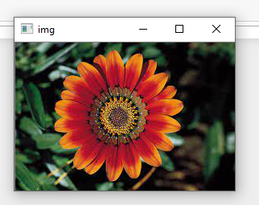
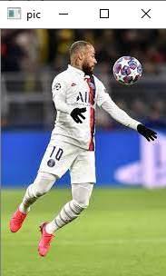
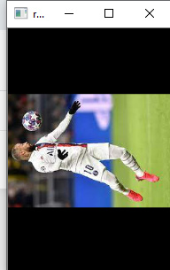
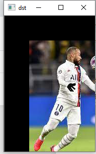
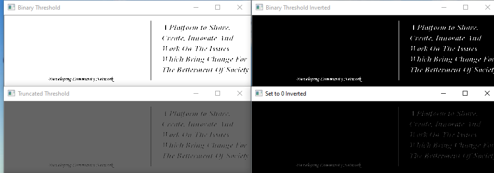
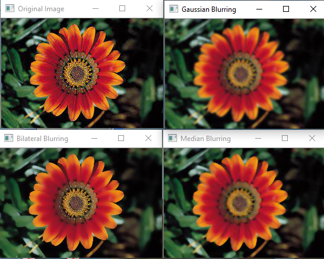
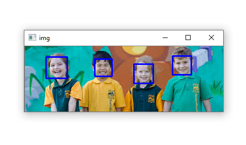

<h2>Image Processing Samples</h2>
<ul>
	<li>Reading an image</li>
	<li>Rotate an image</li>
    <li>Image translation</li>
	<li>Rotate an image</li>
    <li>Image threshold</li>
	<li>Image filtering</li>
    <li>Face detection</li>
</ul>
<h3>Implementation</h3>
<li>Reading an image</li> 
 
<li>Rotate an image</li>

Original image

 

Rotate
 
 
<li>Image translation</li> 
 
<li>Image threshold</li> 

Original image
 
 
 
<li>Image filtering</li> 
 
<li>Face detection</li>

